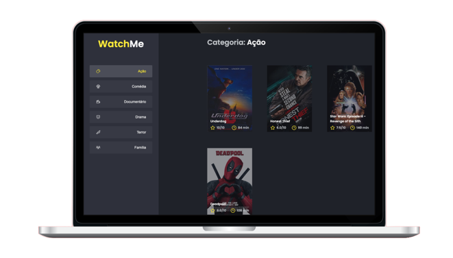

# WatchMe &middot;  
 

  

 

## 🖥 Functionalities
- Bring Genres and movies from a Fake API
- Select Genres on Sidebar to see genre related movies

 

## 📝 License

MIT License © Yuri Paiva. Check [LICENSE](LICENSE) for more details

 

Made with 💜 &nbsp;by Yuri Paiva